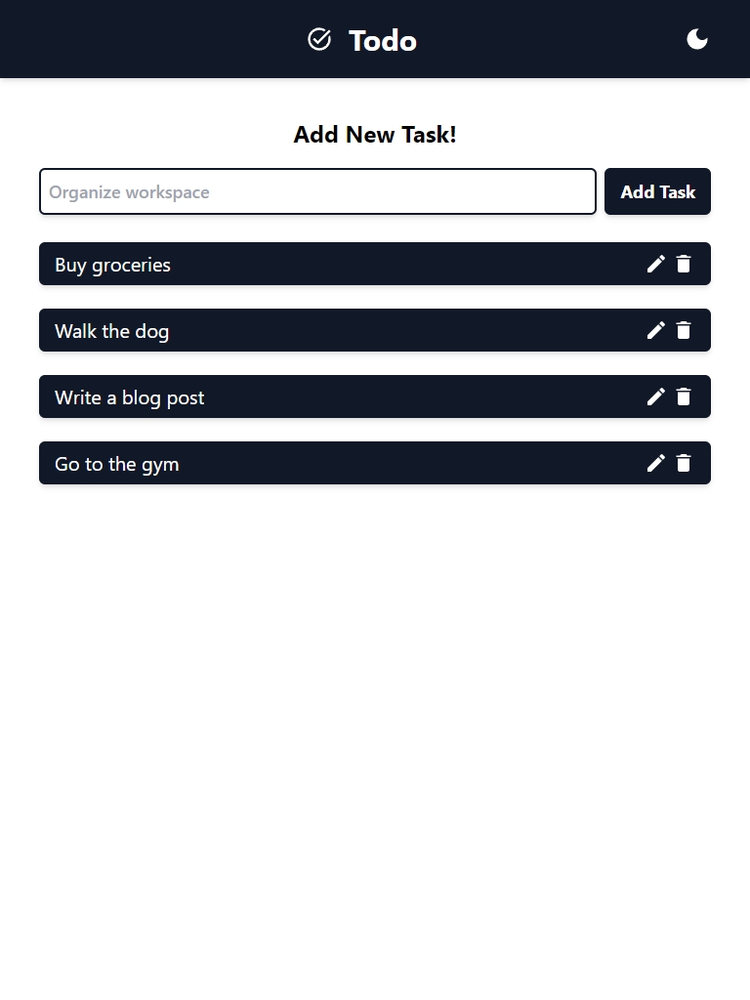
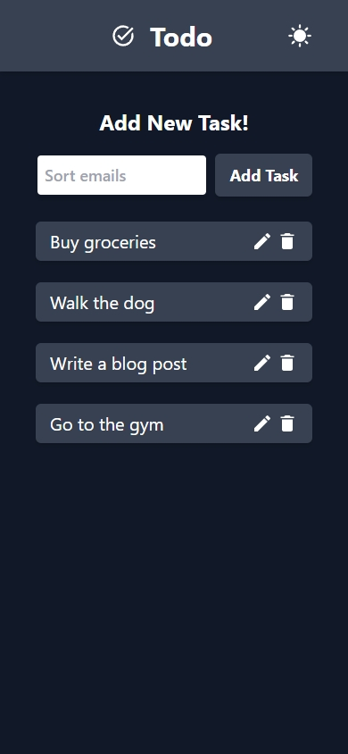

# Todo Full-Stack Web Application

A minimalist task manager with dark mode.




## Technologies

Frontend:

- [React](https://reactjs.org/): A popular JavaScript library for building user interfaces.
- [TypeScript](https://www.typescriptlang.org/): A statically typed superset of JavaScript that helps catch errors and improve code quality.
- [Tailwind CSS](https://tailwindcss.com/): A utility-first CSS framework that enables rapid UI development.
- [Axios](https://axios-http.com/): A promise-based HTTP client for making API requests from the browser.
- [Vite](https://vitejs.dev/): A fast build tool and development server that enhances the frontend development experience.

Backend:

- [Python](https://www.python.org/): A versatile and widely used programming language.
- [FastAPI](https://fastapi.tiangolo.com/): A modern, fast, web framework for building APIs with Python 3.7+ based on standard Python type hints.
- [Pydantic](https://pydantic-docs.helpmanual.io/): A data validation and settings management library for Python. It is used with FastAPI for data validation.
- [Uvicorn](https://www.uvicorn.org/): An ASGI server that runs the FastAPI application.
- [MongoDB](https://www.mongodb.com/): A popular NoSQL database for storing and managing structured data.
- [Motor](https://motor.readthedocs.io/): An asynchronous driver for MongoDB, designed for use with Python's asyncio library.

## Installation using Docker

To set up the application, follow these steps:

1. Clone this repository:

```bash
git clone https://github.com/lesskop/todo-fullstack.git
cd todo-fullstack
```

2. Build and start the application using Docker Compose:

```bash
docker-compose up -d
```

### Accessing the Application

After successfully starting the application in Docker container, you can access the following endpoints:

- Todo: http://localhost:5173

- FastAPI Swagger UI: http://localhost:8000/docs
